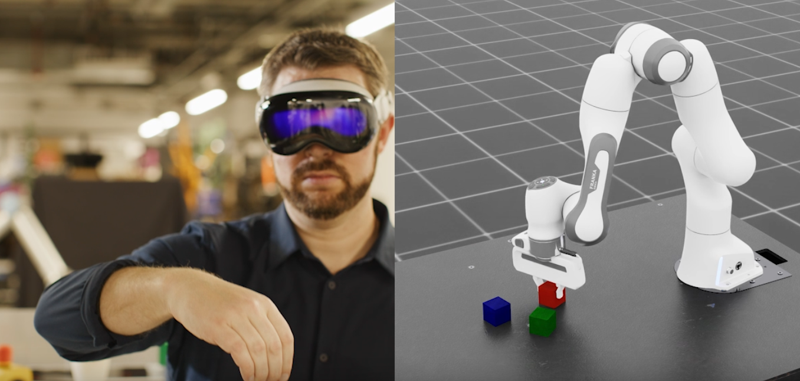
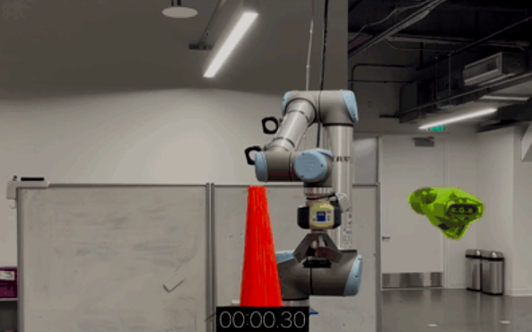
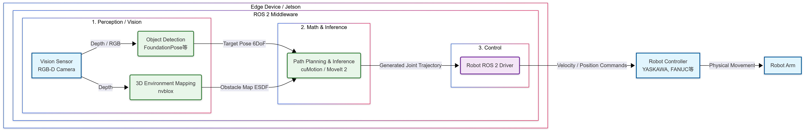
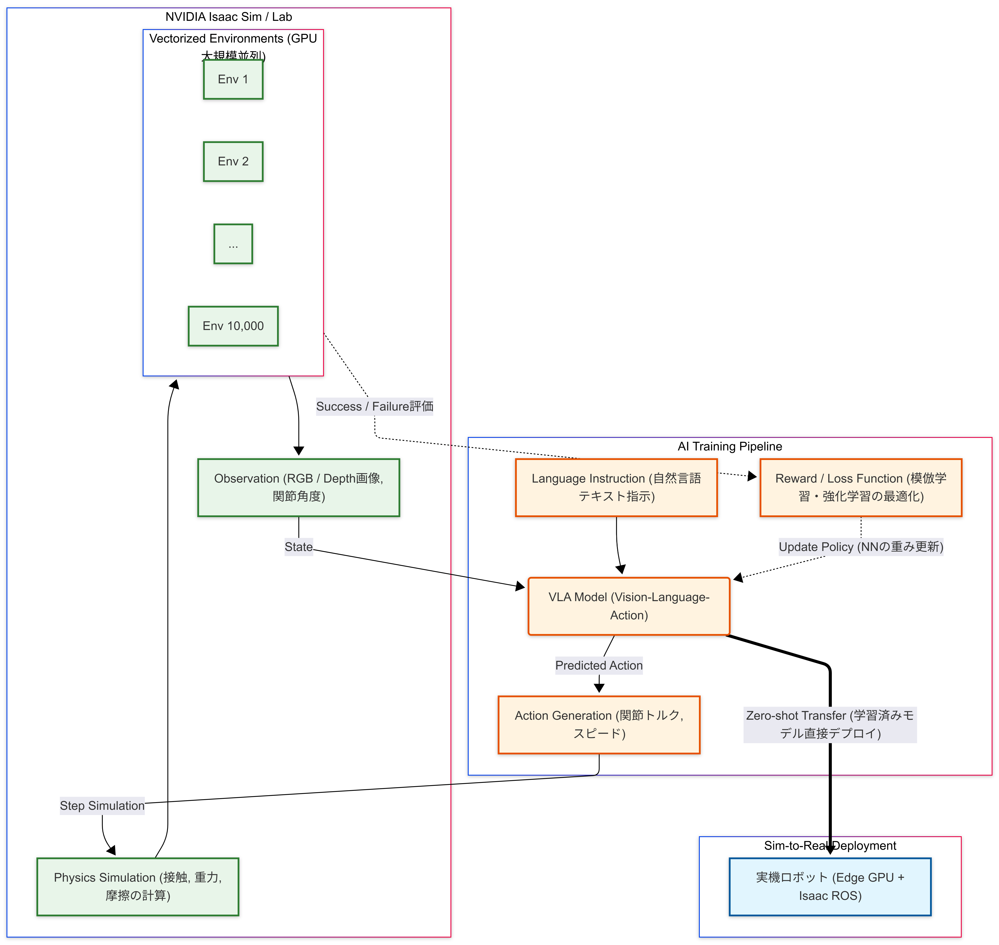
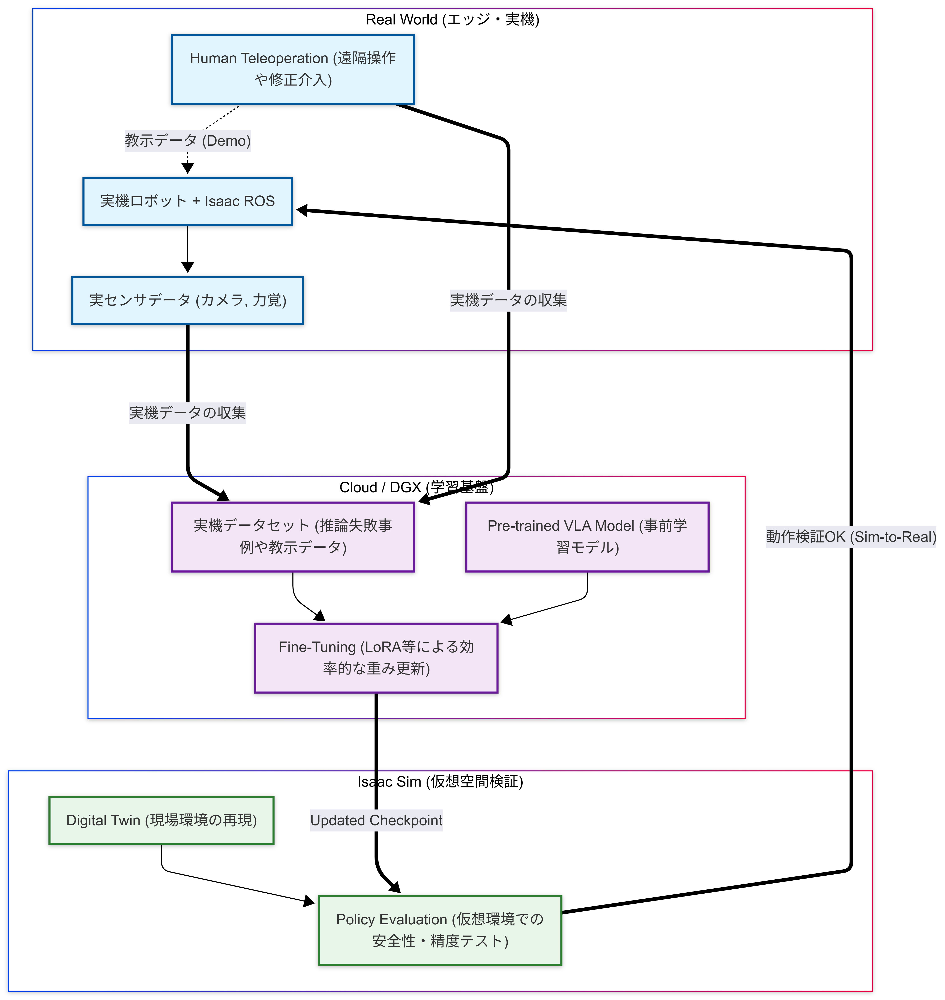
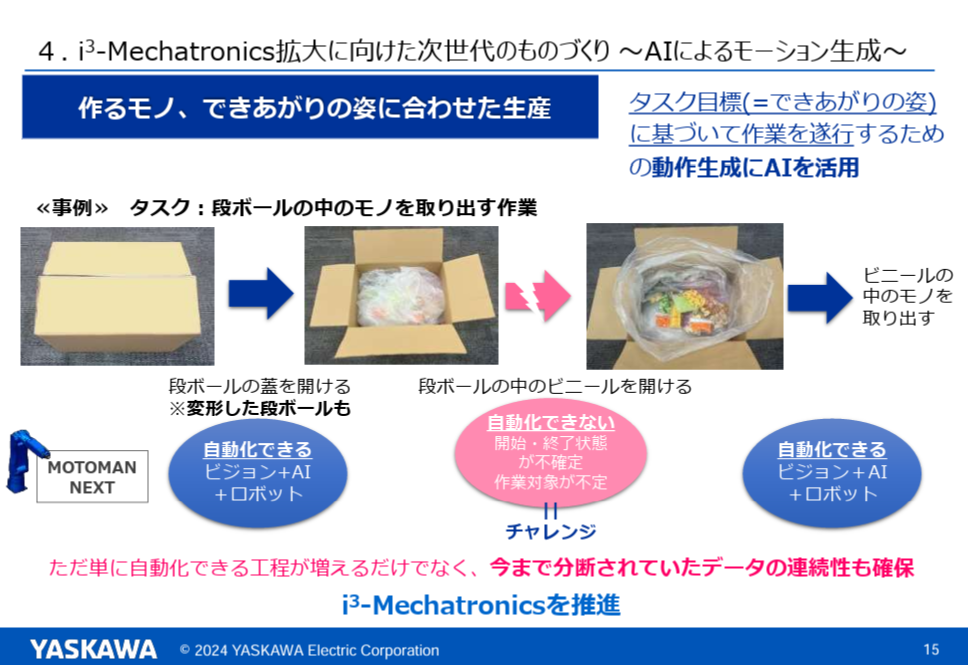
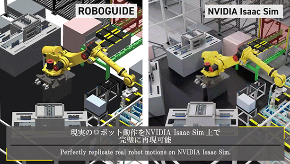

# Isaac プラットフォーム全体の整理
<!--
_color: white
-->

---

## 目的

NVIDIAが展開するフィジカルAIに関するサービスの全容と、開発にあたっての開発パスを整理する。
開発キットのカタログを見ても168種類のツールが存在し、適切なサービスにアクセスするだけで骨が折れる。

---

# 第1章: NVIDIA プラットフォームの全体像

---

## 1-0. NVIDIA DEVELOPERの分類

- **Accelerated Computing**: GPUの演算能力を最大限に引き出すための基盤ツール群（CUDAプラットフォームやライブラリ）
- **AI Training and Inference**: 生成AIやディープラーニングモデルの開発から、実環境への推論（デプロイ）までをカバーする環境
- **Cloud Development**: AIトレーニング等に最適化されたマルチノードのクラウドインフラやコンテナカタログの提供
- **Simulation**: 物理的に正確なロボティクス開発やデジタルツインを構築するための仮想世界プラットフォーム

---

### 1-1. Accelerated Computing

GPUコンピューティングの基盤となるツール群

- **CUDA Toolkit**: GPUアプリケーション開発のためのコンパイラ、ライブラリ、デバッガを含む統合環境。
- **CUDA-X Libraries**: AI、HPC、グラフィックス向けに最適化されたライブラリ群 (cuBLAS, cuDNN, RAPIDS等)。
- **Nsight Developer Tools**: システム全体やカーネルレベルのプロファイリング・最適化ツール。

---

### 1-2. AI Training and Inference

AIモデルの開発、学習、推論を高速化するプラットフォーム

- **Training & Customization**
  - **NVIDIA NeMo**: 会話型AIや生成AIモデル(LLM)の構築・カスタマイズ。
  - **TAO Toolkit**: 事前学習済みモデルを微調整(Transfer Learning)するためのローコードツール。
- **Inference & Deployment**
  - **TensorRT**: 学習済みモデルを実運用向けに最適化・高速化する推論エンジン。
  - **Triton Inference Server / NVIDIA NIM**: 複数モデル・フレームワークに対応した推論サービングソフトウェア群と即時デプロイ用コンテナ。

---

### 1-3. Cloud Development

クラウドネイティブなAI開発環境とリソース

- **Compute & Platform**
  - **NVIDIA DGX Cloud** (AIトレーニング特化GPUクラスタ) / **Base Command** (ジョブ管理)
- **Software Catalog**
  - **NGC Catalog**: GPU最適化済みのコンテナ、学習済みモデルのハブ。
  - **API Catalog**: 最新基盤モデルや推論APIをブラウザで試せるサイト。

---

### 1-4. Simulation & Digital Twins

物理AIと仮想世界のためのプラットフォーム

- **Core Platform**
  - **NVIDIA Omniverse** (OpenUSDベースの3Dプラットフォーム) / **OpenUSD** (オープン標準)
- **Robotics & AI Agents**
  - **Isaac Sim**: ロボティクス向けアプリケーションの学習・テスト用シミュレータ。
  - **Cosmos**: 物理世界を理解・生成するためのワールド基盤モデル。
  - **ACE**: デジタルヒューマン向けAIマイクロサービス。

---

# 第2章: Physical AI (Isaac) エコシステムの整理

---

## 2-1. Isaac コアサービス一覧

- **Simulation & Learning**
  - **Isaac Sim**: 物理的に正確な仮想環境でのシミュレーション
  - **Isaac Lab**: 強化学習・ロボット学習のためのフレームワーク
- **Edge Deployment**
  - **Isaac ROS**: ROS 2 開発者向けの高速化ライブラリ群
- **Models & Intelligence**
  - **Project GR00T**: ヒューマノイド向け基盤モデル
  - **Cosmos**: 物理世界を理解するワールドモデル
- **Applied Libraries**
  - **Isaac Perceptor**: AMR (自律移動ロボット) 向け視覚認識
  - **Isaac Manipulator**: マニピュレータ向け動作計画・制御

---

## 2-2. Isaac Sim (仮想) と Isaac ROS (物理) の役割

**AI・ロボティクス開発における両輪**

* **Isaac Sim / Isaac Lab (仮想空間)**
  * **役割:** ロボットの設計、テスト、AIモデル用合成データ生成、強化学習(RL)
  * **特徴:** OpenUSDベースの物理的に正確なシミュレータ。失敗が許される安全な環境で「脳」を鍛える。
* **Isaac ROS (物理空間)**
  * **役割:** 鍛えられた「脳」を物理ロボットに組み込み、現実世界でリアルタイムに動かす
  * **特徴:** 実機（Jetson等）のGPUを活用し、DNN推論やSLAM等を高速処理するROS 2ノード群 (旧Isaac SDKの後継)。

---

## 補足: なぜ標準の ROS 2 だけでなく「Isaac ROS」が必要なのか？

**ROS 2 の課題と、Isaac ROS による解決策**

* **標準の ROS 2 (CPU主体):**
  * ロボットの各パーツ機能をつなぐ、世界標準の「神経網」（ミドルウェア）。
  * **課題:** カメラ映像からのAI物体認識や、3D地図生成といった「重い計算」をCPUで行うと、処理落ちや遅延が発生しリアルタイムに動けない。
* **Isaac ROS (GPUによる高速化):**
  * 重い計算（AI推論、自己位置推定、軌道計算）だけを **Jetson等のGPUへオフロード（肩代わり）して超高速化する**、ROS 2専用の追加パッケージ群。
  * **結論:** これまでのロボット開発資産（ROS 2）はそのまま活かしつつ、「ボトルネックになる脳の処理」だけを NVIDIA の AI パワーに置き換える役割を果たす。

---

## 2-3. 基盤モデル: Project GR00T / Cosmos

- **Project GR00T**: ロボットが自然言語による指示や人間の動作から学習するためのマルチモーダル基盤モデル。
- **Cosmos**: 物理法則を学習したワールドモデル。シミュレーション内での予測や生成に利用される。

---

# 第3章: 開発パスと ROS 2 連携アプローチ

---

## 3-1. 開発パス: Simulation First Approach

実機レスから始める効率的なロボット開発手法

1. **Isaac Sim / Lab**: 仮想空間での学習、検証、データ生成
2. **Isaac ROS**: 実機へのデプロイ、エッジAIの実装
3. **Omniverse / Cosmos**: デジタルツイン構築、高度な推論

---

## 3-2. Sim と ROS の連携パターン: Bridge vs MoveIt 2

シミュレーションとROSの連携には、目的ごとに異なる2つのアプローチが存在します。

### パターンA: ROS 2 Bridge 連携（全体検証向け）
* **仕組み:** Isaac Sim内の仮想ロボットと、外部のROSネットワークを「Bridgeノード」で中継・通信させる手法。
* **特徴:** カメラ画像やLiDARデータをシミュレータから実機と同じ名前で配信し、ハードインザループに近い純粋な結合テストが可能。

### パターンB: MoveIt 2 連携（実稼働・制御向け）
* **仕組み:** Isaac ROSパッケージ（`cuMotion`等）を、ROS標準の `MoveIt 2` プラグインとして組み込む。
* **特徴:** シミュレータを介さず、実機のROS 2環境内で最適化された軌道計算をGPUでミリ秒単位にて完結させる本番デプロイ構成。

---

# 第4章: 実践ユースケース

---

## 4-1. Isaac Sim アプローチ手法の Use Case

**目的に応じて3つの主要なアプローチを選択可能**

1.  **Synthetic Data Generation (合成データ生成)**
    - AIモデル学習用のラベル付き大量データを仮想空間で生成。 (例: 認識精度向上、事故データ収集)
2.  **Reinforcement Learning (強化学習)**
    - `Isaac Lab` 等を用い試行錯誤から制御ポリシーを学習。 (例: 接触操作、不整地歩行)
3.  **Digital Twin (デジタルツイン)**
    - 現実の工場を仮想に再現しレイアウト検証を実施。 (例: サイクルタイム検証、複数ロボット連携)

---

## 4-2. GR00T-Mimic による合成データ生成

人間の少数の動作データから、ロボット向けの大量の合成学習データを生成する仕組み。

1. **Demonstration Recording**: Apple Vision Pro等を使用し、シミュレーション内のロボットを遠隔操作して「手本」を記録。
2. **Synthetic Motion Generation**: **GR00T-Mimic** が物理的に正しい多様な動作パターンを自動生成。
3. **Data Augmentation**: **Cosmos** 等で環境条件（背景・照明）を変えてデータ拡張。

**メリット:** 実機でのティーチング時間を劇的に削減し、模倣学習(Imitation Learning)に必須となる高品質なデータを短時間で大量に用意可能。

---

## 4-3. Isaac ROS マニピュレータの Use Case

**自律的な障害物回避とPick & Place**

- **STEP 1: Perception (環境・対象認識)**
  - `nvblox` (3D深度地図生成) / `FoundationPose` (6DoF姿勢推定)
- **STEP 2: Motion Planning (動作計画) by Isaac ROS cuMotion**
  - **Motion Gen:** MoveIt 2と統合し、障害物回避軌道をミリ秒単位で超高速計算。
  - **Self-Filtering:** カメラ映像から「ロボット自身の写り込み」を除去し、クリーンな環境地図を構築。
- **STEP 3: Control (実行)**
  - 生成軌道をROS 2ドライバ経由で実機コントローラへ送信。

---

### 【補足】isaac ROS cuMotion

[Isaac ROS cuMotion](https://nvidia-isaac-ros.github.io/repositories_and_packages/isaac_ros_cumotion/index.html)は、ROS 2向けにGPU(CUDA)で最適化された2つの主要機能を提供します。

- 高速な動作計画 (Motion Generation): 
    - MoveIt 2と統合し、障害物回避を含めたアームの軌道をミリ秒単位で超高速に計算します。
- 自己遮蔽の除去 (Self-Filtering): 
    - カメラの深度映像から「ロボット自身の写り込み」を正確に識別・除去し、ノイズのないクリーンな障害物環境だけを再構築します。

---

### 【図解1】Isaac ROS を用いたシステム構成と動作フロー

実機ロボットにおいて、カメラ映像から経路計画に至るまで、どこにNVIDIA AI（Isaac ROS）が介在しているかを示すアーキテクチャ図です。

---

### 【図解2】VLAモデルの学習を用いたシステム構成図

---

### 【図解3】Sim to Realでのファインチューニング構成図

---

## 4-4. 産業用ロボットメーカーにおける NVIDIA AI の活用事例

---

### 1. 安川電機 (YASKAWA)
* **MOTOMAN NEXT の展開:** NVIDIA Jetson プラットフォームと Isaac Manipulator (FoundationPose等) を統合した自律型ロボットを商用化。
* **未知環境への適応:** これまで人間レベルの認識・判断が必要だった食品、物流、農業などの非定型タスク（例：スマートな食材のパッキング）を、NVIDIAのAIによって実現。
[ソース](chrome-extension://efaidnbmnnnibpcajpcglclefindmkaj/https://www.yaskawa.co.jp/wp-content/uploads/2024/06/IR2406_02.pdf)

---

### 2. ファナック (FANUC)
* **ROBOGUIDE と Isaac Sim の統合:** 高精度シミュレータ「ROBOGUIDE」を Isaac Sim と連携させ、写真のレベルでリアルな仮想工場を構築（OpenUSD形式の「SimReady asset」としてCRXシリーズ等を提供）。[ソース](https://www.fanuc.co.jp/ja/product/robot/function/roboguide_omniverse.html)
* **ROS 2 によるオープン化:** 協働ロボット（CRX等）向けの ROS 2 ドライバを公開し、開発者が NVIDIA Isaac の最先端ライブラリを直接活用しやすい環境を整備。

---

## まとめ: 実機制御における NVIDIA の役割

従来 CPU では処理しきれなかった高度な計算を GPU でリアルタイム化

1.  **認識・判断の高速化 (CUDA Acceleration)**
    - 3D再構成や軌道生成を GPU で並列処理し、数百Hzの制御ループを実現。
2.  **最新 AI モデルの実装 (Foundation Models)**
    - 論文レベルの最新手法を最適化済みの ROS 2 ノードとして即座に提供。
3.  **標準規格への準拠 (ROS 2 / MoveIt 2)**
    - 既存のロボットアーム資産を活かしつつ、「脳」の部分だけを最新の NVIDIA AI にアップグレード可能。

---

## 第5章: 実装上の問題